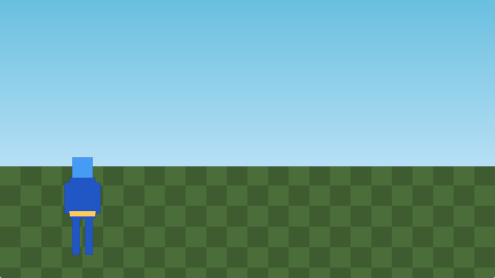

# Bebeu

*The name is **BE**vy + **B**eat **E**m **U**p.*

A Rust beat-em-up engine (Bevy) + visual editor (Dioxus desktop), distributed as a workspace.

For now, this is a personal hobby project, shared in the open in case anyone finds it useful — no general-framework ambitions and no support SLA. Direction may evolve as the project matures.



> 日本語版は下にあります。

## Status

Early scaffolding. APIs, data formats, and the editor UI are all still in motion. Expect breaking changes.

## Platforms

Developed and tested on Windows 11. The engine (Bevy) should work on Linux and macOS, but the editor (Dioxus desktop) and the `just` recipes (which assume a POSIX shell) haven't been verified on those platforms.

## Workspace layout

```
packages/
  engine/          # Bevy-based runtime (binary: beatemup)
  editor-desktop/  # Dioxus desktop editor for authoring projects
tools/
  asset-gen/       # CLI that writes the placeholder PNGs under sample-projects/
sample-projects/
  minimal/         # CC0 placeholder project (hero vs. enemy on a training stage)
docsite/           # VitePress documentation site
```

## Requirements

- Rust 1.96+ (toolchain pinned in `rust-toolchain.toml`)
- `cargo-nextest` (`cargo install cargo-nextest --locked`) for `just test`
- `just` (https://github.com/casey/just) — task runner
- For the editor: Node.js (tailwindcss / daisyui via npm) and `dioxus-cli` (`just editor-desktop-install-cli`)

## Run the sample project

```
just engine-run-sample --project main
```

`engine-run-sample` sets `BEATEMUP_RUNTIME_DIR` to `sample-projects/minimal`,
so the engine reads its character / level / project YAML from that tree. The
placeholder PNGs are committed under that tree, so a fresh clone runs without
any pre-step. (`just gen-sample` regenerates them from `tools/asset-gen` if
you tweak the generator.) The title scene that opens is intentionally empty —
press **Enter** or **Space** to advance to the battle scene.

## Run the editor

```
just editor-desktop-setup    # one-time: dx CLI + npm deps + tailwind
just editor-desktop-dev      # hot reload
```

The editor reads `packages/editor-desktop/bebeu-editor.yml`, whose
`workspace_dir` points at `sample-projects/minimal` in this public build.
Edit any project YAML there and re-run the engine to see the change.

## Bringing your own assets

`sample-projects/minimal` ships only with generated single-color placeholders.
To author a real game, copy `sample-projects/minimal` somewhere outside the
repo, point `BEATEMUP_RUNTIME_DIR` (and the editor's `workspace_dir`) at the
copy, and replace the sprites / sounds / YAML in place.

## Documentation

A VitePress documentation site lives under `docsite/`. To browse locally:

```
just docsite-setup   # one-time: npm install
just docsite-dev     # http://localhost:5173
```

There is no hosted version yet. Doc sources sit directly under `docsite/` (see `index.md` and the `engine/` / `editor/` subdirs). Design decisions are recorded as ADRs under [.claude/adr/](.claude/adr/).

## License

Licensed under either of

- Apache License, Version 2.0 ([LICENSE-APACHE](LICENSE-APACHE) or http://www.apache.org/licenses/LICENSE-2.0)
- MIT license ([LICENSE-MIT](LICENSE-MIT) or http://opensource.org/licenses/MIT)

at your option.

Unless you explicitly state otherwise, any contribution intentionally submitted
for inclusion in the work by you, as defined in the Apache-2.0 license, shall
be dual licensed as above, without any additional terms or conditions.

### Sample assets

Everything under `sample-projects/` (including the generated PNGs from
`tools/asset-gen`) is released under
[CC0 1.0 Universal](https://creativecommons.org/publicdomain/zero/1.0/).

---

# 日本語

*名前は **BE**vy + **B**eat **E**m **U**p から。*

Rust 製のベルトスクロールアクション engine (Bevy) と、それ専用のビジュアル editor (Dioxus desktop) を 1 つの cargo workspace にまとめたものです。

今のところは個人の趣味プロジェクトを公開しているだけで、汎用 framework を目指していたりサポートを保証しているわけではありません。今後の発展次第で位置づけは変わるかも。

## 状態

スキャフォールディング段階で、API・データ形式・editor UI とも頻繁に変わります。破壊的変更を許容してください。

## プラットフォーム

開発と動作確認は Windows 11 のみ。engine (Bevy) は Linux / macOS でも動くはずですが、editor (Dioxus desktop) と `just` レシピ (POSIX shell 前提) はそれらでの動作未確認です。

## ディレクトリ

| パス | 内容 |
|------|------|
| `packages/engine` | Bevy ベースの runtime (`beatemup` バイナリ) |
| `packages/editor-desktop` | Dioxus desktop の editor |
| `tools/asset-gen` | sample-projects 用のプレースホルダー画像を書き出す CLI |
| `sample-projects/minimal` | CC0 プレースホルダー素材で構成した最小プロジェクト |
| `docsite` | VitePress のドキュメント |

## サンプル起動

```
just engine-run-sample --project main
```

`engine-run-sample` は `BEATEMUP_RUNTIME_DIR=sample-projects/minimal` を渡して起動するため、engine はそのツリーから YAML を読みます。プレースホルダー PNG は `sample-projects/minimal/` 配下に commit 済みなので、clone 直後に追加手順なしで動きます (`tools/asset-gen` を弄った場合は `just gen-sample` で再生成)。最初に出る title scene は空っぽなので、**Enter** か **Space** を押して battle scene に進んでください。

## エディタ起動

```
just editor-desktop-setup
just editor-desktop-dev
```

editor は `packages/editor-desktop/bebeu-editor.yml` の `workspace_dir` を参照し、ここでは `sample-projects/minimal` に向けてあります。

## 自前プロジェクトを作るとき

`sample-projects/minimal` を repo の外にコピーし、`BEATEMUP_RUNTIME_DIR` と editor の `workspace_dir` を新しいパスに向けてください。Public ビルドの `sample-projects/` 配下は CC0 です (`tools/asset-gen` の生成物含む)。

## ドキュメント

VitePress 製のドキュメントが `docsite/` にあります。ローカルで閲覧:

```
just docsite-setup   # 初回: npm install
just docsite-dev     # http://localhost:5173
```

hosting はまだ無し。ソースは `docsite/` 直下 (`index.md` と `engine/` / `editor/` サブディレクトリ)。設計判断は [.claude/adr/](.claude/adr/) の ADR として番号付きで蓄積しています。
